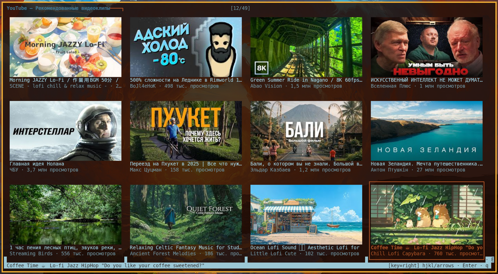

# YouHub — консольный YouTube-клиент

Полноценный YouTube-клиент для терминала: TUI-сетка с превью, воспроизведение в 1080p, рекомендации, поиск, SponsorBlock, статистика просмотров — без браузера, без yt-dlp в пути воспроизведения.

[Подробно в видео](https://www.youtube.com/watch?v=NwrO-gzd-50)




---

## Что это

YouHub — это терминальный YouTube, работающий целиком из консоли. Вместо браузера — kitty-терминал с сеткой превью, вместо веб-плеера — кастомный `ffplay-yt` (форк FFplay из FFmpeg 4.3.9 с IPC-расширениями). Видеопоток получается напрямую через реверс-инженерный протокол SABR (Server ABR) YouTube, без посредников вроде yt-dlp.

### Ключевые особенности

- **TUI-сетка** — адаптивная раскладка превью через kitty graphics protocol, навигация стрелками/hjkl
- **Видео до 1080p60** — H.264 предпочтительно (быстрое декодирование), Opus-аудио
- **Кастомный плеер** — `ffplay-yt` с боковой панелью рекомендаций, переключением скорости (1×/1.5×/2×), анимированными оверлеями
- **SponsorBlock** — автоматический пропуск спонсорских вставок с визуальной индикацией
- **Поиск** — встроенный поиск по YouTube прямо из сетки
- **Бесконечная прокрутка** — лента подгружается автоматически при прокрутке вниз
- **Превью при наведении** — через 3 секунды на тайле начинается слайд-шоу из 4 кадров с плавными кроссфейдами
- **Перемотка** — стрелками влево/вправо (±5с/±30с), с автоматическим перезапуском SABR-сессии при перемотке за пределы буфера
- **Статистика просмотров** — просмотренные видео попадают в историю YouTube (влияют на рекомендации)
- **OAuth через TV-пейринг** — «откройте youtube.com/activate и введите код», без хранения пароля
- **Обход бот-стены** — 24 стратегии ротации TLS-отпечатков с автоматическим перебором
- **Без постоянного браузера** — PO Token генерируется через bgutils-js + jsdom (без Playwright в рантайме)
- **Поддержка прокси** — SOCKS5/HTTP прокси через переменные окружения

---

При нажатии Enter открывается окно ffplay-yt с видео и боковой панелью рекомендаций (Tab).

---

## Требования

### Система

- **Linux** (X11) — тестировалось на Debian 11
- **Терминал kitty** >= 0.26 (нужен kitty graphics protocol)
- **Python 3.11**
- **Node.js** >= 18
- **FFmpeg** >= 4.3 (системный, для мультиплексирования)
- **SDL2** >= 2.0.14 (для ffplay-yt)
- **xdotool**, **wmctrl** (управление окнами X11)

### Опционально

- **SOCKS5/HTTP прокси** 
- **Шрифт DejaVu Sans** — для текста в панели рекомендаций (`fonts-dejavu` в Debian)

---

## Установка

### 1. Клонирование

```bash
git clone https://github.com/HelpFreedom/youthub.git
cd youthub
```

### 2. Python-окружение

```bash
python3.11 -m venv .venv
source .venv/bin/activate
python3.11 -m pip install curl_cffi httpx Pillow
```

### 3. Node-зависимости

```bash
npm install
```

Это установит `youtubei.js`, `googlevideo`, `bgutils-js`, `jsdom`, `canvas` и выполнит post-install патч (`scripts/patch_googlevideo.mjs`).

### 4. Сборка ffplay-yt

ffplay-yt — это минимальная кастомная сборка FFplay из FFmpeg 4.3.9 с IPC-расширениями. Патченный исходник лежит в `ffplay-yt/ffplay.c`.

```bash
# Скачиваем исходники FFmpeg 4.3.9
mkdir -p ffplay-yt/src && cd ffplay-yt/src
apt source ffmpeg=7:4.3.9-0+deb11u2
# Или: wget https://ffmpeg.org/releases/ffmpeg-4.3.9.tar.xz && tar xf ffmpeg-4.3.9.tar.xz
cd ffmpeg-4.3*

# Подставляем патченный ffplay.c
cp ../../ffplay.c fftools/ffplay.c

# Конфигурируем минимальную сборку
./configure \
  --disable-everything \
  --enable-gpl --enable-version3 \
  --enable-decoder=h264,vp9,libdav1d,opus,aac,mp3,mjpeg,png \
  --enable-demuxer=matroska,mov,webm \
  --enable-protocol=file,pipe,unix,fd \
  --enable-filter=aresample,scale,atempo,volume \
  --enable-parser=h264,vp9,opus,aac \
  --enable-libdav1d --enable-libopus \
  --enable-sdl2 --enable-ffplay \
  --enable-indev=alsa \
  --disable-doc --disable-htmlpages --disable-manpages \
  --disable-ffmpeg --disable-ffprobe

# Сборка
make ffplay -j$(nproc)

# Копируем бинарник
mkdir -p ../../bin
cp ffplay ../../bin/ffplay-yt
cd ../../..
```

**Зависимости сборки** (Debian/Ubuntu):

```bash
sudo apt install build-essential nasm \
  libsdl2-dev libdav1d-dev libopus-dev \
  libavcodec-dev libavformat-dev libswscale-dev libavutil-dev
```

### 5. Системные утилиты

```bash
sudo apt install xdotool wmctrl fonts-dejavu
```

### 6. Прокси (опционально)

Если используете прокси, экспортируйте переменную:

```bash
export HTTPS_PROXY="socks5://127.0.0.1:1080"
```

---

## Запуск

```bash
# Запуск в kitty-терминале
.venv/bin/python3.11 grid_demo.py
```

### Первый запуск — OAuth-пейринг

При первом запуске YouHub попросит авторизоваться через TV-пейринг:

1. Откройте https://youtube.com/activate в браузере
2. Введите отображённый код (формат `XXXX-XXXX`)
3. Подтвердите доступ для аккаунта

Токены сохраняются в `cache/oauth.json` (chmod 600). Повторный пейринг нужен только если refresh token протухнет.

### Cookie-аутентификация (для watchstats)

Для атрибуции просмотров (чтобы видео попадали в историю YouTube) нужны cookie из Firefox:

```bash
# Экспортируйте cookie из Firefox
python3.11 extract_cookies.py

# Cookie сохраняются в cache/yt_cookies.txt (chmod 600)
```

Отключить watchstats: `export WATCHSTATS_COOKIES=0`

---

## Управление

### Сетка (grid_demo.py)

| Клавиша | Действие |
|---------|----------|
| `←↑↓→` / `hjkl` | Навигация по тайлам |
| `Enter` | Воспроизведение выбранного видео |
| `f` / `а` | Поиск по YouTube |
| `r` / `к` | Обновить ленту |
| `PgUp` / `PgDn` | Постраничная прокрутка |
| `Home` | В начало |
| `q` / `й` | Выход |

### Плеер (ffplay-yt)

| Клавиша | Действие |
|---------|----------|
| `←` / `→` | Перемотка ±5 сек |
| `↓` / `↑` | Перемотка ±30 сек |
| `Space` | Пауза |
| `1` | Скорость 1× |
| `2` | Скорость 2× |
| `3` | Скорость 3× |
| `Tab` | Открыть/закрыть панель рекомендаций |
| `q` / `Esc` | Выход из плеера |
| `m` | Mute |
| `9` / `0` | Громкость −/+ |

### Утилитарные скрипты (bin/)

| Скрипт | Назначение |
|--------|-----------|
| `bin/yt-kill-video` | Принудительно закрыть окно ffplay (для привязки к dwm keybind) |
| `bin/yt-toggle-overlay` | Скрыть/показать окно ffplay (map/unmap, аудио продолжает играть) |

---

## Архитектура

```
grid_demo.py   (TUI-сетка — kitty graphics protocol)
      │
      │ Enter → воспроизведение
      ▼
bridge_player.py   (оркестратор)
      │
      ├──→ sabr_bridge.mjs   (Node.js SABR-мост)
      │        │
      │        ├──→ po_token.mjs      (PO Token: bgutils-js + jsdom)
      │        ├──→ pr_fetch.py       (playerResponse: curl_cffi, 24 стратегии)
      │        ├──→ youtubei.js       (дешифровка n-параметра)
      │        └──→ googlevideo       (SabrStream → fMP4-сегменты)
      │                 │
      │                 ▼
      │           ffmpeg (мультиплексор) → /tmp/ytlive_<id>.mkv
      │
      ├──→ ffplay-yt                  (плеер: SDL2 + IPC)
      │        │
      │        └──→ Unix socket       (POS, SEEK_REQ, OPEN, QUIT, RECS_ITEM...)
      │
      ├──→ recs_pipeline.py           (рекомендации для боковой панели)
      ├──→ sponsorblock.py            (авто-пропуск спонсорских вставок)
      └──→ watchstats.py              (пинги статистики просмотра)
```

### Видеопоток

1. `pr_fetch.py` получает `ytInitialPlayerResponse` с YouTube через curl_cffi (реальные TLS-отпечатки Chrome/Firefox/Safari), обходя бот-стену
2. `po_token.mjs` генерирует PO Token (Proof of Origin) через BotGuard-чаллендж в jsdom (без браузера)
3. `sabr_bridge.mjs` использует `youtubei.js` для дешифровки URL и `googlevideo` SabrStream для потоковой загрузки H.264+Opus через протокол SABR
4. `ffmpeg` мультиплексирует видео и аудио в растущий `.mkv`-файл
5. `ffplay-yt` воспроизводит этот файл, общаясь с `bridge_player.py` через IPC-сокет

### Обход бот-стены YouTube

YouTube блокирует автоматизированные запросы по TLS-отпечатку (JA3/JA4). Система ротации в `pr_fetch.py` использует 24 стратегии:

- **12 TLS-баз**: 7 HTML-скрейпинг (`chrome131`, `chrome145`, `firefox133`, `safari184`, `safari180_ios`, `chrome131_android`, `edge101`) + 5 InnerTube POST (`ANDROID_VR`, `IOS`, `MWEB`, `TVHTML5`, `WEB_EMBEDDED_PLAYER`)
- **2 режима прокси**: напрямую / через `HTTPS_PROXY`
- **Предварительное чередование**: соседние стратегии отличаются и по TLS-семейству, и по прокси
- **Липкий выбор**: рабочая стратегия используется пока не заблокируют
- **Полный перебор**: при воспроизведении перебираются все 24 стратегии за один клик

Состояние ротации сохраняется между сессиями в `cache/strategy_state.json`.

---

## Структура файлов

### Основной конвейер

| Файл | Назначение |
|------|-----------|
| `grid_demo.py` | Главная точка входа — TUI-сетка с навигацией |
| `bridge_player.py` | Оркестратор воспроизведения (мост, плеер, SponsorBlock, рекомендации) |
| `sabr_bridge.mjs` | Персистентный Node.js SABR-стриминг-мост |
| `pr_fetch.py` | Получение playerResponse с ротацией TLS-стратегий |
| `po_token.mjs` | Генерация PO Token без браузера (bgutils-js + jsdom) |
| `po_minter.mjs` | Чеканка PO Token из готового integrity token |
| `sponsorblock.py` | Клиент SponsorBlock API (авто-пропуск спонсорских вставок) |
| `recs_pipeline.py` | Получение и рендеринг рекомендаций для боковой панели |
| `watchstats.py` | Пинги статистики просмотра (история YouTube) |
| `auth_cookies.py` | Cookie-аутентификация с SAPISIDHASH |

### Модуль `youthub/`

| Файл | Назначение |
|------|-----------|
| `innertube.py` | Клиент InnerTube API (TVHTML5): home, search, next, player |
| `auth.py` | OAuth 2.0 Device Grant (TV-пейринг) |
| `feed.py` | Парсер ответов InnerTube в структуры Video/Shelf/Feed |
| `feed_loader.py` | Движок бесконечной прокрутки |
| `graphics.py` | Kitty Graphics Protocol (передача PNG в терминал) |
| `terminal.py` | Размер терминала, KeyReader (raw-ввод + UTF-8) |
| `thumbnails.py` | Дисковый кэш превью с параллельной предзагрузкой |
| `preview.py` | Слайд-шоу при наведении (4 кадра с кроссфейдами) |

### Кастомный плеер

| Файл | Назначение |
|------|-----------|
| `ffplay-yt/ffplay.c` | Патченный FFplay: IPC-сокет, боковая панель, оверлеи, анимации |

### Вспомогательное

| Файл | Назначение |
|------|-----------|
| `sabr.py` | Чисто-питоновский клиент протокола SABR (research/fallback) |
| `proto_edit.py` | Round-trip библиотека для Protobuf |
| `proto_dump.py` | Инспектор Protobuf-сообщений |
| `bootstrap.py` | Browser-based bootstrap (legacy, для отладки) |
| `extract_cookies.py` | Экспорт cookie из Firefox |
| `scripts/patch_googlevideo.mjs` | Post-install патч для npm-пакета googlevideo |

### Утилиты диагностики

| Файл | Назначение |
|------|-----------|
| `ump_extract.py` | Извлечение медиа-треков из UMP-потока |
| `ump_inspect.py` | Инспектор UMP-сообщений |
| `probe_potoken.py` | Диагностика PO Token |
| `protocol_dump.py` | Запись сетевого трафика YouTube |
| `verify_history.py` | Проверка попадания видео в историю YouTube |

### Тесты

| Файл | Назначение |
|------|-----------|
| `test_innertube.py` | Тест InnerTube API + OAuth-пейринг |
| `test_tvpair.py` | Тест TV Device Grant (проверка client_id) |
| `test_cookieexchange.py` | Тест обмена cookie |
| `test_cookieping.py` | Тест пинга с cookie |
| `test_logevent.py` | Тест отправки событий |

### Ранние прототипы

| Файл | Назначение |
|------|-----------|
| `player.py` | Первый плеер (yt-dlp + ffplay) |
| `tui_player.py` | Видео целиком в терминале через kitty graphics |
| `stream_player.py` | Стриминг через FIFO (заменён bridge_player) |
| `live_stream.py` | Стриминг live-трансляций через Playwright |

---

## Кэширование

Все кэши хранятся в `cache/` (создаётся автоматически):

| Файл | TTL | Описание |
|------|-----|----------|
| `oauth.json` | до отзыва | OAuth-токены (chmod 600) |
| `yt_cookies.txt` | до протухания | Cookie Firefox (chmod 600) |
| `strategy_state.json` | постоянно | Состояние ротации TLS-стратегий |
| `innertube_home.json` | 120 сек | Кэш домашней ленты |
| `innertube_next.json` | 120 сек | Кэш /next pivot |
| `pr_<vid>.json` | 12 часов | Кэш playerResponse |
| `sponsorblock_<vid>.json` | 24 часа | Кэш сегментов SponsorBlock |
| `thumbnails/<vid>.jpg` | бессрочно | Превью-изображения |
| `recs_thumbs/<vid>.jpg` | бессрочно | Превью для боковой панели |
| `recs_text/<vid>.png` | бессрочно | Текстовые полоски рекомендаций |

---

## Анимации ffplay-yt

Кастомный ffplay-yt включает несколько анимированных оверлеев, рендерящихся через SDL2:

### Переключение скорости (клавиши 1/2/3)
Полупрозрачная капсула с текущей скоростью (`1.0×`, `1.5×`, `2.0×`) — ease-out-back анимация с «пружинящим» эффектом, длительность 0.85 сек.

### Слайд боковой панели (Tab)
Панель рекомендаций выезжает справа с ease-out-cubic анимацией (0.22 сек). Видео плавно сдвигается влево.

### Перемотка (стрелки)
Два шеврона (`▶▶` / `◀◀`) с текстом (`+5s`, `-30s`) — fade-in/fade-out, 0.7 сек.

### SponsorBlock-пропуск
Цветная метка категории + «skipped Xs» внизу экрана — выезд снизу, 1.6 сек. Цвет зависит от типа: sponsor=зелёный, selfpromo=жёлтый, intro=циановый, outro=синий и т.д.

Все оверлеи рендерятся через встроенный 3×5 bitmap-шрифт (`SPEED_GLYPH[16][5]`) и примитивы SDL_RenderFillRect (совместимость с SDL 2.0.14, без SDL_RenderGeometry).

---

## Технические решения

1. **Без yt-dlp в пути воспроизведения** — прямой SABR через `googlevideo` npm-пакет
2. **Без mpv** — кастомный ffplay-yt с IPC, полный контроль
3. **Без постоянного браузера** — PO Token через bgutils-js + jsdom (BotGuard JS в headless DOM)
4. **H.264 вместо VP9** — в 2-3× быстрее программное декодирование, запас для atempo
5. **Растущий файл** — ffmpeg пишет .mkv, ffplay читает по мере роста. Перемотка за буфер → новая сессия (OPEN по IPC)
6. **24 стратегии ротации** — TLS × прокси × эндпоинт, липкий выбор + полный перебор при неудаче
7. **Cookie-based watchstats** — настоящие пинги `/api/stats/watchtime` с SAPISIDHASH
8. **Только чтение** — никаких лайков/комментариев/подписок. Kill-switch `WATCHSTATS_COOKIES=0`

---

## Безопасность

- OAuth-токены и cookie хранятся с правами `chmod 600`
- Используются только read-only API-эндпоинты (статистика просмотра)
- Нет записи лайков, комментариев, подписок
- Kill-switch `WATCHSTATS_COOKIES=0` полностью отключает отправку cookie
- client_id для TV-пейринга — публичный (Kodi/SmartTubeNext), не требует собственного Google Cloud-проекта
- API-ключи в коде — стандартные публичные ключи YouTube (InnerTube, BotGuard), не являются секретами

---

## Переменные окружения

| Переменная | По умолчанию | Описание |
|-----------|-------------|----------|
| `HTTPS_PROXY` | — | URL прокси (`socks5://host:port` или `http://host:port`) |
| `WATCHSTATS_COOKIES` | `1` | `0` = отключить отправку watchstats |

---

## Известные ограничения:

- Только X11 (Wayland не тестировался)
- Только терминал kitty (нужен graphics protocol)
- Без аппаратного ускорения декодирования (только CPU)
- Без поддержки DRM-контента (YouTube Premium Originals)
- Перемотка за пределы буфера занимает 1-3 секунды (перезапуск SABR-сессии)
- YouTube периодически меняет протоколы — может потребоваться обновление `youtubei.js` / `googlevideo`

---

## Авторы

- **Black Triangle** — автор и архитектор проекта
- **Claude** (Anthropic) — со-разработчик, ассистент по коду

---

## Лицензия

GNU General Public License v3.0 — см. [LICENSE](LICENSE).

---

## Благодарности

- [youtubei.js](https://github.com/LuanRT/YouTube.js) — дешифровка подписей и n-параметра
- [googlevideo](https://github.com/nicholasgasior/googlevideo) — клиент протокола SABR
- [bgutils-js](https://github.com/nicholasgasior/bgutils-js) — BotGuard challenge solver
- [curl_cffi](https://github.com/yifeikong/curl_cffi) — HTTP с реальными TLS-отпечатками
- [SponsorBlock](https://sponsor.ajay.app/) — краудсорсинговая база спонсорских сегментов
- [FFmpeg](https://ffmpeg.org/) — основа ffplay-yt
